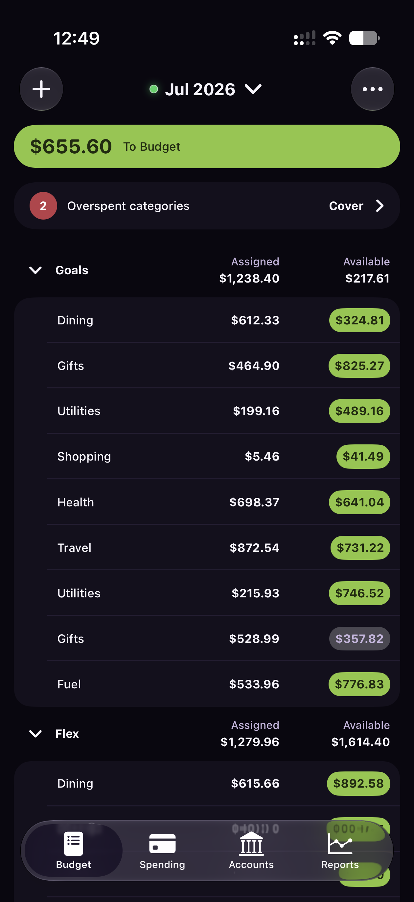
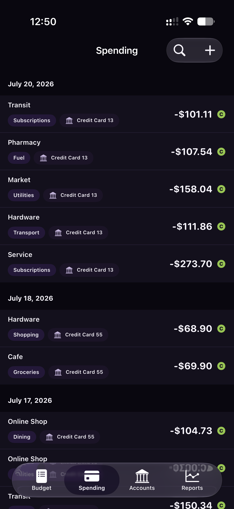
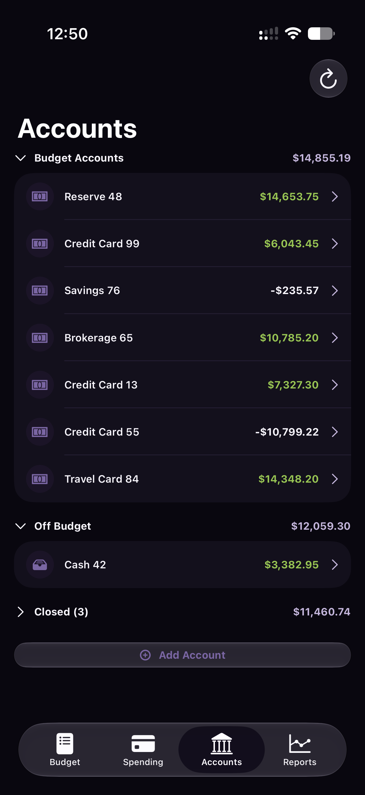
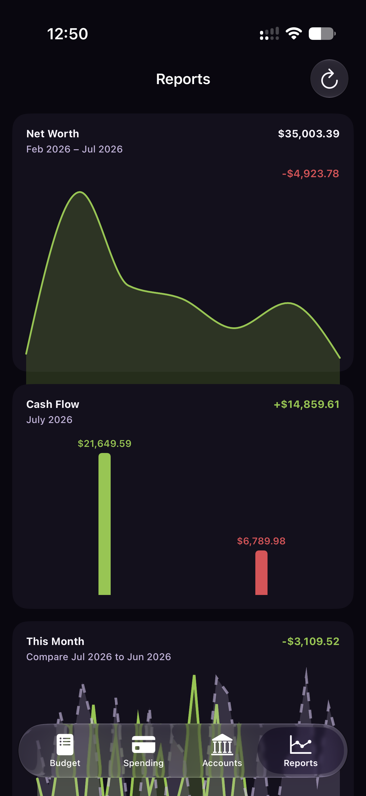

# Actualist

**A native, local-first iPhone client for [Actual Budget](https://actualbudget.org/).**


Actualist connects directly to a normal Actual sync server, imports your budget
to a local SQLite database, and renders from that local copy. It is designed for
quick, repeated budget review on iPhone, with native SwiftUI navigation and iOS
Liquid Glass controls.

> [!CAUTION]
> **Actualist is beta software and can modify real financial data.** Before using
> it, export and verify
> [a backup of every budget you plan to test](https://actualbudget.org/docs/backup-restore/backup/).
> Do not rely on Actualist as the only copy of your data, and only test with a
> budget you are prepared to restore.

## App Preview

<p align="center">
  
  
  
  
</p>

<p align="center"><sub>Budget · Spending · Accounts · Reports<br>Screenshots use randomized display values.</sub></p>

## What Actualist Does

- Shows monthly category groups, assigned amounts, available balances, To Budget,
  uncategorized transactions, and overspending alerts.
- Provides an all-account Spending feed plus searchable transaction histories for
  individual accounts.
- Supports common transaction flows, including create, edit, delete, categorize,
  split, and transfer.
- Supports core budget writes such as category assignment, move money, and
  category rollover.
- Shows on-budget, off-budget, and closed accounts, with local account ordering.
- Includes native reports for net worth, cash flow, monthly comparisons, budget
  overview, spending averages, and transaction activity.
- Opens an imported budget from local storage first, then syncs Actual CRDT
  messages in the background.
- Queues offline changes locally and uploads them when the Actual server is
  reachable again.
- Supports Actual budgets with optional end-to-end encryption.
- Includes display density, theme, privacy, and background-refresh settings.

Actualist is a companion to Actual Budget, not a replacement for the Actual
server or web app. It does not use or require an `actual-http-api` REST wrapper.

## Requirements

- An iPhone running iOS 26 or later.
- A running [Actual Budget server](https://actualbudget.org/docs/install/) with at
  least one budget already uploaded for sync.
- Network access from the iPhone to that server. If the server is available only
  through a VPN, Tailscale, or another private network, connect the iPhone to that
  network first.
- Your Actual server password.
- For an encrypted budget, the separate budget encryption password.

Beta testers should install the app through the TestFlight invitation supplied
for their test group. Developers can also [build from source](#building-from-source).

## Connecting to Your Server

1. Launch Actualist.
2. Enter the full URL of your Actual server, for example
   `https://budget.example.com`.
3. Enter the **server password** used to sign in to Actual, then tap **Connect**.
4. Choose a budget from the server.
5. If the budget uses end-to-end encryption, enter its separate encryption
   password when prompted.
6. Leave Actualist open while the initial budget download and import completes.

Actualist prefers HTTPS and blocks plain HTTP for remote servers. Local HTTP URLs
such as `http://192.168.1.20:5006`, private and link-local IPv6 addresses, and
Tailscale `100.64.0.0/10` or `*.ts.net` hosts are allowed for trusted local
networks, but the connection is not encrypted. The inline warning names the
credentials exposed by plain HTTP before connecting.

After the first successful import, Actualist keeps a local budget copy for fast
launches and offline use. Connection, budget selection, sync, display, and data
management controls are available from **Settings**, opened from the Budget
screen's gear or overflow menu.

### If Connection Fails

- Open the server URL in Safari on the same iPhone to confirm it is reachable.
- Check that the phone is connected to the required Wi-Fi, VPN, or tailnet.
- Use HTTPS for any server that is not on the local network.
- Confirm that you entered the server password, not the budget encryption
  password.
- If the budget is encrypted, confirm the second password when selecting it.
- Update the Actual server and retry before reporting a sync-version problem.

## Beta Safety

- Keep regular Actual exports and make a new
  [backup](https://actualbudget.org/docs/backup-restore/backup/) before each beta
  update. Know how to [restore it](https://actualbudget.org/docs/backup-restore/restore/).
- Verify important totals and recent changes in the official Actual client during
  testing.
- Let a pending offline change finish syncing before deleting the app or erasing
  its local data.
- Treat **Reimport Budget** and **Erase Local Data** as recovery tools; read their
  confirmations carefully.
- Do not post real server URLs, passwords, sync tokens, encryption keys, budget
  IDs, or unredacted financial data in issues or screenshots.

### Local Data and Device Backups

Actualist intentionally excludes its imported budget directory from iPhone and
iCloud device backups. This includes the local SQLite budget, its sidecar files,
metadata, reimport recovery copy, and the durable sync outbox. The Actual server
is the authoritative recovery source for changes that have finished syncing.

An outbox change is not on the server until its upload is confirmed. If the
iPhone is lost, the app is deleted, or local data is erased while changes are
still pending, those changes are lost and cannot be recovered from a device
backup. This is an explicit privacy tradeoff: Actualist does not place a second
plaintext copy of the budget in the device-backup path. Before replacing or
erasing a device, open Actualist while online and confirm Settings shows
**Pending Sync: None**.

### Experimental Features

Experimental features are opt-in and disabled by default. **Budget Templates are
experimental** and can change many assignments at once. Back up before applying
them and verify the result in Actual.

## Current Limitations

- Actualist does not trigger bank-provider imports. Transactions imported by the
  Actual server or another Actual client will arrive through normal sync.
- Account reconciliation is not yet available.
- Account lifecycle actions beyond adding an account are incomplete.
- Rule preview and application are not yet available.
- Budget Templates support only a subset of Actual's template behavior and remain
  experimental.

## Reporting Bugs

Found a problem? Please
[open a GitHub issue](https://github.com/sporez/actualist/issues/new) rather than
assuming a failed write or sync will repair itself.

In Actualist, open **Settings → Support → Share Diagnostic Report** and attach
the generated text file. The report includes app, device, configuration,
local-store, sync, and background-refresh state while excluding credentials,
server addresses, identifiers, names, budget contents, transaction details, and
financial amounts.

Include:

- Actualist version and build number.
- iOS version and iPhone model.
- Actual server version and hosting method.
- Whether the budget uses end-to-end encryption.
- Whether the problem happened online, offline, or while reconnecting.
- Exact steps to reproduce, expected behavior, and actual behavior.
- A redacted screenshot or error message when useful.

For a data-integrity problem, stop repeating the action, preserve your backup,
and say clearly in the issue that the report may involve a wrong balance, missing
transaction, duplicate transaction, or unexpected budget write.

## Building From Source

You will need macOS, Xcode 26 or later, and an iOS 26 simulator or device.

```sh
git clone https://github.com/sporez/actualist.git
cd actualist
open Actualist.xcodeproj
```

Resolve Swift packages in Xcode, select the `Actualist` scheme, and run the app.
The repository also includes a simulator helper:

```sh
scripts/run-ios-simulator.sh --boot
```

Run the test suite with an installed iOS 26 simulator:

```sh
xcodebuild \
  -project Actualist.xcodeproj \
  -scheme Actualist \
  -destination 'platform=iOS Simulator,name=iPhone 17 Pro' \
  -derivedDataPath .derivedData \
  test
```

See [docs/DEVELOPMENT.md](docs/DEVELOPMENT.md) for the full development and
release workflow.

## Project Architecture

Actualist is a SwiftUI app with a local-first data path:

1. Authenticate with the normal Actual sync server.
2. Download and import the selected Actual budget database.
3. Render reads from local SQLite.
4. Apply writes locally as Actual-compatible CRDT messages.
5. Store pending messages in a durable outbox and opportunistically sync them.

The app stores sync tokens and unlocked budget keys in the iOS Keychain. Budget
data remains in the app's private local container and on the Actual server you
choose.

Actualist is an independent community project and is not affiliated with or
endorsed by the Actual Budget project.
