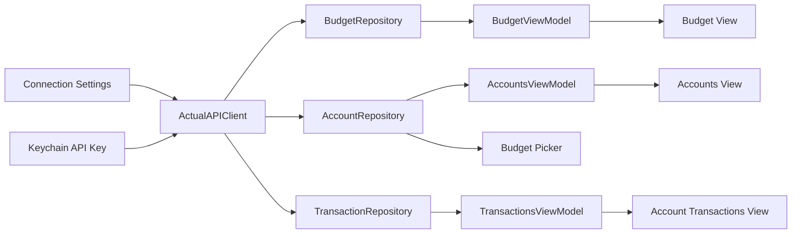

# Actualist iOS App Plan

## Product Direction

Actualist will be a native iOS 26+ app for browsing and eventually managing an Actual Budget file through the Actual HTTP API. The app should feel like the screenshots in `reference/`: dark, dense, rounded, thumb-friendly, Liquid Glass-aware, with bold money states and native floating-feeling tab chrome.

Initial scope is a connected read experience:

- First launch presents onboarding for the server URL and API key.
- Connect to the Actual HTTP API and validate credentials.
- Pull available budgets and let the user choose which budget to load.
- Show the current month budget envelope view.
- Show accounts grouped into open/off-budget/closed sections, with closed accounts collapsed by default.
- Drill into an account and show transactions grouped by date.
- Allow server details, API key, and selected budget to be changed from Settings.
- Keep the view models and action surfaces ready for later write operations such as category transfers, covering overspending, editing transactions, and adding transactions.

Confirmed platform decisions:

- Swift and SwiftUI only.
- No UIKit for application UI.
- Standard Xcode Swift/SwiftUI app project.
- iOS 26+ deployment target.
- Use real SwiftUI Liquid Glass APIs where glass belongs, especially navigation, toolbars, menus, buttons, sheets, and tab surfaces. Do not fake glass with `Material`, blur views, or translucent custom capsules.
- Use native SwiftUI tab/menu chrome matching the screenshots' floating feel, but include only real implemented views.

## Reference UI Notes

### Shared Shell

- Dark background close to black: `#05050D`.
- Raised content surfaces: `#111226` to `#17182D`.
- Control pills: `#28293A` / `#303149` with subtle highlight borders.
- Accent blue/purple: `#7D83FF`.
- Positive green: `#8CC63E` to `#9BD34D`.
- Warning red: `#E54B55`.
- Yellow available pill: `#F1C84B`.
- Primary text: near-white `#F6F6FB`.
- Secondary text: `#B8B9C7`.
- Bottom tab bar: native Liquid Glass tab chrome with a floating feel and selected highlight. Do not replace it with a custom glass-on-glass tab control.
- Typography should use native San Francisco with heavier weights for section headers and money values.
- Settings should eventually expose theme colors, but the first theme should hard-code the screenshot palette behind design tokens.
- Content rows and financial data should remain mostly solid/dark for legibility.
- Liquid Glass should be reserved for navigation and controls that float above content. Use `.buttonStyle(.glass)`, `.buttonStyle(.glassProminent)`, `.buttonStyle(.glass(...))`, and `.glassEffect(_:in:)`; avoid stacking glass on top of glass. Do not use `GlassEffectContainer` until it is explicitly re-tested on physical device.
- Respect system accessibility behavior for reduced transparency, increased contrast, and reduced motion.

Initial tabs:

- Budget: planning/envelope style icon, for the category envelope view.
- Accounts: `building.columns.fill`, for account lists and transaction drill-in.
- Settings: `gearshape.fill`, for server details, API key, budget selection, and later theme controls.

Do not include placeholder tabs for Home, Spending, or Reflect until those features exist.

### First Launch And Settings

- First launch shows a focused setup screen before the main app shell.
- Required setup fields:
  - Server URL.
  - API key.
- After server details are entered, the app tests the connection.
- If the connection succeeds, the app fetches budgets and presents a budget picker.
- Settings includes the same server URL and API key controls, plus a change-budget action.
- API key entry should use secure text entry and clear save/test states.
- Settings should eventually expose color/theme choices. The first build uses the screenshot palette.

### Budget View

Reference: `reference/Budget.PNG`

- Top navigation includes month picker centered and compact action buttons.
- Primary alert: large green `Ready to Assign` / Actual `toBudget` amount.
- Secondary alert: overspending count with `Cover` action.
- Category groups are expandable.
- Hidden categories are collapsed by default when surfaced.
- Group headers show group name plus assigned and available totals.
- Category rows show name, assigned amount, and available amount pill.
- Available pill states:
  - Positive: green.
  - Zero/inactive: gray.
  - Overspent: red or warning treatment.
  - Credit/payment special cases may use yellow/green depending on Actual semantics.
- Empty/hidden/income categories should be filtered or visually separated based on user setting.

### Accounts View

Reference: `reference/Accounts.PNG`

- Large `Accounts` title.
- Top-right add and overflow controls.
- Group sections with disclosure control and group total.
- Account rows show account icon, name, current balance, and drill-in chevron.
- Closed accounts collapse into a summary row by default.
- Add Account button is present but can be disabled or placeholder in the first read-only build.

### Account Transactions View

Reference: `reference/Account Transactions.PNG`

- Account name, linked status, current working balance.
- Search/select/overflow controls can start as non-functional placeholders.
- Credit accounts get a `Record Payment` action placeholder.
- Transactions grouped by date.
- Transaction row shows payee/imported payee, category chip, amount, and cleared status.
- First write phase can add transaction edit and create screens.

## API Mapping

OpenAPI source: `reference/openapi.json`.

Base server template from the OpenAPI file:

```text
{protocol}://{host}:{port}/{basePath}
```

The app should store these connection settings:

- Server URL, entered as one URL field with no default value. If the user enters only a scheme/host/port, normalize it by appending `/v1`.
- API key.
- Selected `budgetSyncId`.

Security:

- Store API key in Keychain.
- Store non-secret server URL and selected budget ID in app settings.
- Never log the API key.
- Redact secrets in diagnostics and screenshots.

API requests authenticate with the `x-api-key` HTTP header. Budget API paths should use `cloudFileId` from the budget list when it is present, because the REST endpoints expect the budget sync ID:

```sh
curl -fsS \
  -X POST \
  -H "x-api-key: $API_KEY_HERE" \
  http://localhost:5007/v1/budgets/9e5a0d5b-7b6b-40d2-a752-1f7da0516288/accounts/banksync
```

Model this as an `APIKeyAuthenticator` so the transport stays isolated from feature code.

### Startup

- `GET /actualhttpapiversion`
- `GET /budgets`
- `GET /budgets/{budgetSyncId}/actualserverversion`

Startup flow:

1. If server URL or API key is missing, show onboarding.
2. User enters server URL and API key.
3. Test connection with version and budget endpoints.
4. Fetch budgets.
5. If one budget exists, optionally select it automatically after confirmation.
6. If multiple budgets exist, show budget picker.
7. Persist selected budget and enter the main tab shell.
8. Settings can repeat the connection test and budget selection later.

### Budget View

- `GET /budgets/{budgetSyncId}/months`
- `GET /budgets/{budgetSyncId}/months/{month}`

Use `BudgetMonth` as the primary payload because it includes:

- `toBudget`
- `lastMonthOverspent`
- `incomeAvailable`
- `totalBudgeted`
- `totalSpent`
- `totalBalance`
- nested `categoryGroups`

Overspending display logic should be derived from:

- `lastMonthOverspent` for month-level prior overspending.
- Current categories where `balance < 0`.
- Hidden/income categories excluded unless settings request them.

Later write actions:

- `PATCH /budgets/{budgetSyncId}/months/{month}/categories/{categoryId}`
- `POST /budgets/{budgetSyncId}/months/{month}/categorytransfers`
- `POST` and `DELETE /budgets/{budgetSyncId}/months/{month}/nextmonthbudgethold`

### Accounts View

- `GET /budgets/{budgetSyncId}/accounts`
- `GET /budgets/{budgetSyncId}/accounts/{accountId}/balance`

The account list response does not include balances, so the repository should enrich accounts by fetching each balance. Cache balances per refresh pass and surface partial loading states.

Account grouping needs a confirmed data source. The OpenAPI `Account` schema includes `offbudget` and `closed`, but does not include a clear account type such as checking/credit. First implementation can group by:

- Closed
- Off budget
- Open budget accounts

To match the reference more closely, investigate whether `run-query` or another API field can expose account type. If it cannot, provide local user-defined account groups later.

Closed accounts should be collapsed by default when present.

### Account Transactions View

- `GET /budgets/{budgetSyncId}/accounts/{accountId}/transactions`
- `GET /budgets/{budgetSyncId}/payees`
- `GET /budgets/{budgetSyncId}/categories`

Transactions include IDs for payee and category. Load payees/categories into lookup maps so rows can display names and category chips. Prefer `payee_name`, then lookup by `payee`, then `imported_payee`, then fallback text.

Later write actions:

- `POST /budgets/{budgetSyncId}/accounts/{accountId}/transactions`
- `POST /budgets/{budgetSyncId}/accounts/{accountId}/transactions/batch`
- `PATCH /budgets/{budgetSyncId}/transactions/{transactionId}`
- `DELETE /budgets/{budgetSyncId}/transactions/{transactionId}`

## Architecture

Recommended first implementation:

- Native SwiftUI iOS app.
- iOS 26+ target.
- `URLSession` networking with `async/await`.
- Codable API models with an adapter layer for display models.
- Swift Testing or XCTest for formatting, decoding, and view-model logic.
- No database in the first pass; use in-memory repositories, `UserDefaults`/`AppStorage` for non-secret preferences, and Keychain for the API key.
- Use Observation (`@Observable`) for app/view model state where appropriate.
- Use Swift concurrency and keep UI mutations on the main actor.
- Keep the app dependency-light at first. Add Swift packages only when they remove meaningful complexity.

Suggested module layout once the Xcode project is created:

```text
Actualist/
  App/
    ActualistApp.swift
    AppState.swift
    AppRoute.swift
  DesignSystem/
    ActualistTheme.swift
    ActualistGlass.swift
    MoneyText.swift
    PillButton.swift
  API/
    ActualAPIClient.swift
    ActualEndpoint.swift
    ActualAuthenticator.swift
    APIModels.swift
    APIError.swift
  Repositories/
    BudgetRepository.swift
    AccountRepository.swift
    TransactionRepository.swift
  Security/
    KeychainStore.swift
  Persistence/
    AppSettingsStore.swift
  Features/
    Onboarding/
      OnboardingViewModel.swift
    Budget/
      BudgetViewModel.swift
    Accounts/
    Transactions/
    Settings/
      SettingsViewModel.swift
  Shared/
    Money.swift
    MonthIdentifier.swift
    LoadingState.swift
    IdentifiedLookup.swift
ActualistTests/
```

### Data Flow



## Implementation Phases

Current foundation status:

- Phases 0-2 are functionally established for the read-only app foundation.
- Phase 3 is established for the current-month budget read path, expandable category groups, hidden category filtering, `toBudget`, overspending display, loading/error states, and the initial reference-style layout.
- Phases 0-3 now use repositories and feature view models so SwiftUI views stay layout-focused and future budget actions can attach to view-model intents.
- The native SwiftUI tab bar is the accepted implementation of the planned floating menu bar. Earlier custom floating-glass tab experiments were removed to avoid nested Liquid Glass controls.
- Phase 3 still has planned expansion points, especially a real month picker and deeper category action flows.

### Phase 0: Project Foundation

- Create Xcode SwiftUI project named `Actualist`.
- Set deployment target to iOS 26+.
- Add app icons/placeholders.
- Add design tokens matching the reference screenshots.
- Add Liquid Glass navigation/control style tokens.
- Add connection settings model.
- Add first-launch onboarding shell.
- Add basic tab shell with Budget, Accounts, and Settings only.
- Add collapsed-by-default states for hidden/closed sections.

### Phase 1: API Client And Security

- Implement `ActualAPIClient`.
- Implement API key authentication.
- Decode startup endpoints and budget list.
- Build a reusable response wrapper for `{ "data": ... }`.
- Add tolerant decoding where OpenAPI has known mismatches.
- Add money formatting for Actual integer amounts.
- Add API error types and connection test screen.
- Add Keychain-backed API key storage.

### Phase 2: Onboarding And Budget Selection

- Show server URL and API key entry on first launch.
- Validate connection.
- Fetch budgets.
- Show budget picker.
- Persist selected budget.
- Let Settings re-run connection and budget selection.

### Phase 3: Budget View

- Fetch current month budget.
- Render ready-to-assign alert from `toBudget`.
- Render overspending alert from category balances.
- Render expandable category groups and category rows.
- Add month picker scaffolding.
- Add loading, empty, and error states.
- Hidden categories collapsed by default when supported.

### Phase 4: Accounts View

- Fetch accounts and enrich with balances.
- Group open/closed/off-budget accounts.
- Render account list matching the reference.
- Navigate to account transactions.
- Add closed-account collapse behavior.

### Phase 5: Account Transactions View

- Fetch transactions for selected account.
- Fetch payee/category lookup data.
- Group rows by transaction date.
- Show working balance from account balance endpoint.
- Add search/select/action placeholders.

### Phase 6: First Write Features

- Add transaction creation.
- Add transaction edit flow.
- Add category transfer or cover overspending flow.
- Add account payment flow for credit accounts.
- Add refresh controls and optimistic update rules.

## Technical Notes

- Actual amounts appear as integers in the API. Confirm whether the running container returns cents or Actual milliunits before final money formatting. Actual commonly stores amounts in milliunits, where `$1.00` is `1000`.
- The OpenAPI schema marks `BudgetMonthCategoryGroup.name` and `BudgetMonthCategory.name` as integers, but examples show strings. Generated Swift models may need schema correction or custom tolerant decoding.
- Some transaction fields are inconsistent in the schema and examples. For example, `cleared` is typed as a string but examples show boolean. Decode defensively.
- Avoid placing API secrets in source control. Store API keys in Keychain.
- Local container access from a physical iPhone may require host LAN IP and HTTP transport exceptions. Simulator can often use `localhost`; physical devices cannot.

## Testing And Verification

- Decode fixtures from representative API responses.
- Unit test money formatting, date grouping, overspending detection, and account grouping.
- Add screenshot or preview coverage for dark theme states.
- Manually verify against the running API container:
  - First launch requires server URL and API key.
  - Budget picker loads after connection succeeds.
  - Budget screen loads current month.
  - Ready-to-assign alert appears only when `toBudget != 0`.
  - Overspending alert appears when category balances are negative.
  - Accounts display enriched balances.
  - Closed accounts are collapsed by default.
  - Transaction rows display human-readable payee and category names.
  - API key is not visible in logs.

Development pipeline details live in `docs/DEVELOPMENT.md`. The intended loop is:

1. Build with `xcodebuild`.
2. Launch in the iOS 26.3.1 `iPhone 17 Pro` simulator.
3. Capture screenshots with `simctl io screenshot`.
4. Review screenshots and iterate on SwiftUI layout.
5. Add tests/previews for states that regress visually or behaviorally.

## Open Questions

1. Should API keys sync through iCloud Keychain or remain device-local?
2. Should one-budget setups auto-select after a successful connection, or always show the budget picker?
3. Should theme colors appear in Settings during the first build or after the three core screens work?

## External Apple References

- Apple Newsroom: Liquid Glass extends across iOS 26 and related platforms, and Apple positions it as a material for controls, navigation, tab bars, and app chrome.
- Apple Developer: WWDC25 `Meet Liquid Glass` guidance emphasizes keeping Liquid Glass mainly in the navigation/control layer, preserving content legibility, avoiding glass-on-glass, and relying on system accessibility adaptations.
