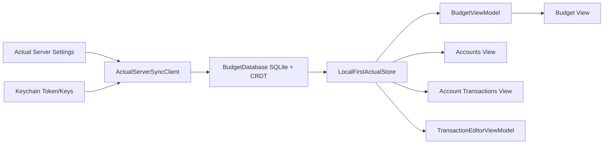

# Actualist iOS App Plan

## Product Direction

Actualist is a native iOS 26+ local-first app for browsing and managing an Actual Budget file through Actual's native sync model. It connects to a normal Actual server, imports the budget SQLite database, applies CRDT messages, and renders from local data. It no longer relies on the sibling `actual-http-api` REST wrapper or its OpenAPI contract. The app should be a polished native UI for Actual, not a second budgeting engine. The app should feel like the screenshots in `reference/`: dark, dense, rounded, thumb-friendly, Liquid Glass-aware, with bold money states and native floating-feeling tab chrome.

Current scope is a local-first budget companion with developer-gated writes:

- First launch presents onboarding for the Actual server URL and password.
- Connect to the normal Actual server, fetch remote file metadata, and import the selected budget.
- Persist the imported SQLite budget locally and keep it current with Actual CRDT sync messages.
- Show the current month budget envelope view.
- Show accounts grouped into open/off-budget/closed sections, with closed accounts collapsed by default.
- Show all-account spending and account-specific transaction feeds.
- Drill into an account and show transactions grouped by date.
- Allow server details, selected budget, sync controls, account ordering, theme, privacy mode, and developer-gated writes to be changed from Settings.
- Implement writes by generating Actual-compatible CRDT messages, applying them to SQLite, enqueueing them in `actualist_outbox`, reloading affected local caches, and opportunistically flushing.

Confirmed platform decisions:

- Swift and SwiftUI only.
- No UIKit for application UI.
- Standard Xcode Swift/SwiftUI app project.
- iOS 26+ deployment target.
- Use real SwiftUI Liquid Glass APIs where glass belongs, especially navigation, toolbars, menus, buttons, sheets, and tab surfaces. Do not fake glass with `Material`, blur views, or translucent custom capsules.
- Use native SwiftUI tab/menu chrome matching the screenshots' floating feel, but include only real implemented views.

## Reference UI Notes

### Shared Shell

- Dark background close to black: `#05050D`.
- Raised content surfaces: `#111226` to `#17182D`.
- Control pills: `#28293A` / `#303149` with subtle highlight borders.
- Accent blue/purple: `#7D83FF`.
- Positive green: `#8CC63E` to `#9BD34D`.
- Warning red: `#E54B55`.
- Yellow available pill: `#F1C84B`.
- Primary text: near-white `#F6F6FB`.
- Secondary text: `#B8B9C7`.
- Bottom tab bar: native Liquid Glass tab chrome with a floating feel and selected highlight. Do not replace it with a custom glass-on-glass tab control.
- Typography should use native San Francisco with heavier weights for section headers and money values.
- Settings should eventually expose theme colors, but the first theme should hard-code the screenshot palette behind design tokens.
- Content rows and financial data should remain mostly solid/dark for legibility.
- Liquid Glass should be reserved for navigation and controls that float above content. Use `.buttonStyle(.glass)`, `.buttonStyle(.glassProminent)`, `.buttonStyle(.glass(...))`, and `.glassEffect(_:in:)`; avoid stacking glass on top of glass. Do not use `GlassEffectContainer` until it is explicitly re-tested on physical device.
- Respect system accessibility behavior for reduced transparency, increased contrast, and reduced motion.

Initial tabs:

- Budget: planning/envelope style icon, for the category envelope view.
- Spending: `creditcard.fill`, for the all-account transaction feed.
- Accounts: `building.columns.fill`, for account lists and transaction drill-in.
- Reports: `chart.xyaxis.line`, for local SQLite-backed financial charts and summaries.

Settings is presented from the Budget toolbar ellipsis menu. Do not include
placeholder tabs for Home or Reflect until those features exist.

### First Launch And Settings

- First launch shows a focused setup screen before the main app shell.
- Required setup fields:
  - Actual server URL.
  - Password.
- After server details are entered, the app logs in and fetches remote budget files.
- If login succeeds, the app presents a budget picker/import flow.
- Settings includes the same server URL controls, a password re-auth path, sync status, and a change-budget action.
- Password entry should use secure text entry and clear save/test states. Tokens and encryption keys stay in Keychain.
- Settings should eventually expose color/theme choices. The first build uses the screenshot palette.

### Budget View

Reference: `reference/Budget.PNG`

- Top navigation includes compact native toolbar buttons with a centered month dropdown. Tapping the month opens a compact year/month picker, and selecting a month reloads that month from local SQLite-backed data.
- Primary alert: large green `Ready to Assign` / Actual `toBudget` amount.
- Secondary alert: overspending count with `Cover` action.
- Category groups are expandable.
- Hidden categories are collapsed by default when surfaced.
- Group headers show group name plus assigned and available totals.
- Category rows show name, assigned amount, and available amount pill.
- Available pill states:
  - Positive: green.
  - Zero/inactive: gray.
  - Overspent: red or warning treatment.
  - Credit/payment special cases may use yellow/green depending on Actual semantics.
- Empty/hidden/income categories should be filtered or visually separated based on user setting.

### Accounts View

Reference: `reference/Accounts.PNG`

- Large `Accounts` title.
- Top-right add and overflow controls.
- Group sections with disclosure control and group total.
- Account rows show account icon, name, current balance, and drill-in chevron.
- Closed accounts collapse into a summary row by default.
- Add Account is available when the developer local-write gate is enabled. It creates the account row and linked transfer payee through CRDT messages, then reloads local accounts.

### Account Transactions View

Reference: `reference/Account Transactions.PNG`

- Account name, linked status, current working balance.
- Search/select/overflow controls can start as non-functional placeholders.
- Credit accounts get a `Record Payment` action placeholder.
- Transactions grouped by date.
- Transaction row shows payee/imported payee, category chip, amount, and cleared status.
- First write phase can add transaction edit and create screens.

## Local-First Data Mapping

The current backend is Actual's native local-first stack:

- `ActualServerSyncClient` talks to the normal Actual server login, file, download, and `/sync/sync` endpoints.
- `BudgetFileManager` owns imported budget files and metadata.
- `BudgetDatabase` reads Actual's SQLite tables and applies CRDT row/column messages.
- `LocalFirstActualStore` is the app source of truth and conforms to the repository protocols used by view models.
- `LocalFirstSyncMessageBuilder` emits Actual-compatible CRDT messages for supported local writes.
- `actualist_outbox` stores pending local sync messages until they are pushed successfully.

The app stores these connection/session values:

- Actual server URL in app settings.
- Actual sync token and local encryption keys in Keychain.
- Selected budget file/group identifiers and display name in app settings.

Security:

- Never log passwords, sync tokens, encryption keys, budget IDs, imported databases, or personal financial data.
- Keep imported budget databases out of git.
- Redact connection and budget identifiers in diagnostics and screenshots unless the user explicitly asks otherwise.

### Startup

Startup flow:

1. If a selected imported budget exists, open its local SQLite database before
   presenting the main tab shell, even when the server is slow or offline.
2. Paint each view from the store's in-memory projection when available, then
   read SQLite locally. View appearance does not initiate network work.
3. Start one shared, coalesced CRDT sync per foreground session and publish a
   data revision after it updates SQLite and the store projections.
4. Pull-to-refresh and every in-view refresh button force that same shared sync,
   join it when already running, then re-read local data without hiding content.
5. If there is no imported selection, show onboarding or remote budget
   selection as appropriate. Remote file discovery is limited to onboarding,
   budget selection, and explicit reimport.

### Budget View

Budget data is derived from SQLite:

- `accounts`, `transactions`, `categories`, `category_groups`, and `zero_budgets` drive `BudgetMonth`.
- `toBudget`, category balances, spending, and totals are computed from local rows using Actual semantics.
- Alerts such as uncategorized transactions and overspent categories are derived natively.
- Hidden/income categories are excluded unless the screen intentionally exposes them.

Supported local-first budget writes currently include category budget assignment,
move money, and fixed-amount budget templates.

### Accounts View

Accounts are read from `accounts` and balances are derived from local transaction rows. Grouping is:

- Open budget accounts.
- Open off-budget accounts.
- Closed accounts.

Add Account is implemented behind the developer local-write gate. It creates:

- An `accounts` row with `name`, `offbudget`, `closed = false`, `tombstone = false`, and `sort_order` when available.
- A linked empty-name transfer payee through `payees.transfer_acct` when the schema supports it.
- A `payee_mapping` row when that table is present.

Initial balance, bank linking, account edit/close/delete, and reconcile remain
out of scope. Provider bank-sync triggers have been removed from the app and
repository contract.

### Transaction Views

Transactions are read from SQLite with payee/category/account lookup maps:

- Account feeds filter by account.
- Spending uses the same transaction presentation across all accounts.
- Payee display resolves through `payee_mapping` and transfer payees.
- Split parents and children are handled according to Actual's table semantics.

Supported local-first transaction writes include simple transaction create/edit/delete, categorization, transfers, and splits. Rule preview/apply is still disabled.

### Write And Refresh Rules

The Swift app should not hand-roll final financial truth outside the local-first database layer. Feature code builds explicit commands; `BudgetDatabase` and `LocalFirstActualStore` apply Actual-compatible local writes and reload from SQLite.

Use a conservative write state machine:

```text
draft -> submitting -> local reload -> clean
draft -> submitting -> failed/retry
```

After any successful write:

- Build CRDT messages with `LocalFirstSyncMessageBuilder`.
- Apply messages to SQLite and insert the same messages into `actualist_outbox` in one database transaction.
- Reload affected local caches before the feature returns to a clean state.
- Opportunistically flush pending messages through `/sync/sync`.
- Keep failed remote pushes queued for later retry; do not roll back a successful local transaction.

## Architecture

Current implementation:

- Native SwiftUI iOS app.
- iOS 26+ target.
- `URLSession` networking with `async/await` for Actual server login, file download, and sync.
- Local SQLite budget storage through GRDB.
- SwiftProtobuf for Actual sync message envelopes.
- Clean app-native models at view/view-model boundaries; keep schema variation and CRDT details isolated in the local-first database/store layer.
- Swift Testing or XCTest for formatting, decoding, and view-model logic.
- `LocalFirstActualStore` is the in-memory source of truth over the local database. Use `UserDefaults`/`AppStorage` for non-secret preferences and Keychain for tokens/encryption keys.
- Use Observation (`@Observable`) for app/view model state where appropriate.
- Use Swift concurrency and keep UI mutations on the main actor.
- Keep the app dependency-light at first. Add Swift packages only when they remove meaningful complexity.

Current module layout:

```text
Actualist/
  App/
    ActualistApp.swift
    AppState.swift
    AppTab.swift
  DesignSystem/
    ActualistTheme.swift
    ActualistGlass.swift
    MoneyText.swift
    PillButton.swift
  API/
    APIModels.swift                 # shared/domain payload models retained for app boundaries
  LocalFirst/
    LocalFirstActualStore.swift     # app source of truth over local SQLite and sync
    Sync/
    Network/
    Database/
    Generated/
  Repositories/
    BudgetRepository.swift          # BudgetRepositoryProtocol + LoadedBudgetMonth
    TransactionRepository.swift     # TransactionRepositoryProtocol + Loaded/Options types
    BudgetAPI.swift                 # shared draft / mutation-result value types
  Security/
    KeychainStore.swift
  Persistence/
    AppSettingsStore.swift
  Features/
    Onboarding/
      OnboardingViewModel.swift
    Budget/
      BudgetViewModel.swift
    Accounts/
    Transactions/
    Settings/
      SettingsViewModel.swift
  Shared/
    Money.swift
    CategoryNameParts.swift
    TransactionGrouping.swift       # pure date grouping + cached formatters
ActualistTests/
```

### Data Flow

All fetched data flows through `LocalFirstActualStore` (an `@MainActor @Observable` store).
SQLite is the durable local source of truth; the store's in-memory projections are only an
instant-paint acceleration layer. Views read those projections and SQLite on appearance, while
the app coordinator owns automatic foreground sync. Manual refresh controls all invoke the same
forced, coalesced sync and then re-read local data.
Every supported write applies CRDT messages locally, enqueues them for sync, and reloads the
affected local caches so dependent screens never show pre-write data. The store conforms to
`BudgetRepositoryProtocol`, `AccountRepositoryProtocol`, and `TransactionRepositoryProtocol`, so
view models inject it in production and inject fakes in tests.



## Implementation Phases

Current foundation status:

- Local-first is the only backend path.
- Budget, Accounts, Spending, account transaction feeds, Settings, onboarding, budget import/open, and background sync notifications are implemented through the native store.
- The native SwiftUI tab bar is the accepted app shell. Earlier custom floating-glass tab experiments were removed to avoid nested Liquid Glass controls.
- Repository protocols are the feature seams; production injects `LocalFirstActualStore`, tests inject fakes.
- Most common write flows are developer-gated and implemented through local CRDT messages plus outbox sync.

Implemented local-first write slices:

- Account creation.
- Simple transaction creation.
- Basic non-split, non-transfer transaction edits.
- Simple transaction deletion through tombstones.
- Categorizing existing transactions.
- Transfer and split transaction create/edit/delete.
- Category budget assignment.
- Move money.
- Fixed-amount budget templates.

Still guarded or not implemented:

- Reconcile.
- Rule preview/apply.
- Account edit, close, and delete.
- Initial balance entry on account creation.
- Unsupported budget template types.

Explicitly excluded:

- Bank sync/provider import triggers. Actualist does not expose a menu action or
  repository contract for remotely starting provider imports.

## Technical Notes

- Actual amount values are integer minor units where a USD amount of `$120.30` is represented as `12030`. Keep amounts as `Int` internally and format as currency only at the display boundary. Do not use `Double` for money.
- Actual SQLite schemas vary across versions and migrations. Probe tables/columns defensively and keep schema variation in `BudgetDatabase`.
- CRDT writes are row/column messages. Do not bypass the message/outbox path with ad hoc SQL for user-facing writes.
- Avoid placing secrets or personal budget data in source control. Store sync tokens and encryption keys in Keychain.
- Local network Actual server access from a physical iPhone may require a LAN host or HTTPS route. Simulator and device behavior differ.

## Testing And Verification

- Test SQLite/CRDT fixtures for budget, account, transaction, and write behavior.
- Unit test money formatting, date grouping, overspending detection, account grouping, and local-write cache reloads.
- Unit test conservative submission state transitions before enabling each write action.
- Add screenshot or preview coverage for dark theme states.
- Manually verify against a throwaway Actual budget:
  - First launch requires Actual server URL and password.
  - Budget picker/import loads after login succeeds.
  - Budget screen loads current month.
  - Ready-to-assign alert appears only when `toBudget != 0`.
  - Overspending alert appears when category balances are negative.
  - Accounts display local balances.
  - Closed accounts are collapsed by default.
  - Transaction rows display human-readable payee and category names.
  - Local writes appear immediately after SQLite reload and later converge through sync.
  - Sync tokens, passwords, encryption keys, budget IDs, and personal data are not visible in logs.

Development pipeline details live in `docs/DEVELOPMENT.md`. The intended loop is:

1. Build with `xcodebuild`.
2. Launch in the iOS 26.3.1 `iPhone 17 Pro` simulator.
3. Capture screenshots with `simctl io screenshot`.
4. Review screenshots and iterate on SwiftUI layout.
5. Add tests/previews for states that regress visually or behaviorally.

## Open Questions

1. When should the developer local-write gate become a normal user-facing capability?
2. Which reports are worth implementing first from local SQLite?

## External Apple References

- Apple Newsroom: Liquid Glass extends across iOS 26 and related platforms, and Apple positions it as a material for controls, navigation, tab bars, and app chrome.
- Apple Developer: WWDC25 `Meet Liquid Glass` guidance emphasizes keeping Liquid Glass mainly in the navigation/control layer, preserving content legibility, avoiding glass-on-glass, and relying on system accessibility adaptations.
